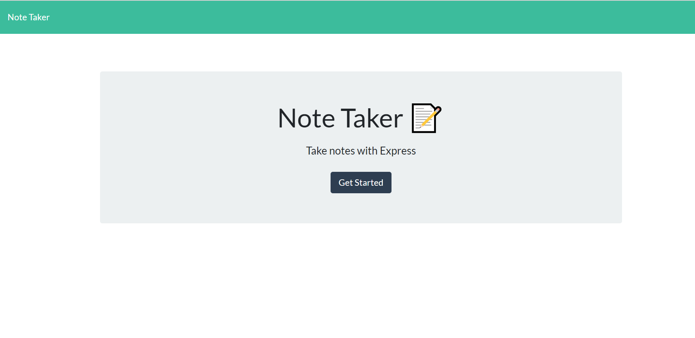

# Note Taker

## Description

This application is to be used to write, save, and delete notes. This application uses an express backend and saves and retrieves note data from a JSON file.

* The application frontend was already been created, my job was to build the backend and connect the two.

* The following HTML routes were created:

  * _GET `/notes` - returns the `notes.html` file._

  * _GET `*` - returns the the `index.html` file_

  * _The application has a `db.json` file on the backend that stores and retrieves notes using the `fs` module._

*   The following API routes were created:

    * _GET `/api/notes` - returns the `db.json` file and returns all saved notes as JSON._

    * _POST `/api/notes` - receives a new note to save on the request body, add it to the `db.json` file, and then returns the new note to the client._

    * _DELETE `/api/notes/:id` - receives a query parameter containing the id of a note to delete._

## User Story

    Users, Can write and save notes

    He/She are able to delete notes They've written before

    SO THAT They can organize their thoughts and keep track of tasks they need to complete

## Business Context

    For users that need to keep track of a lot of information, it's easy to forget or be unable to recall something important. Being able to take persistent notes allows users to have written information available when needed.

## Deployable App link

https://mysterious-badlands-15838.herokuapp.com/

- - -

## Preview of the Deployed application

